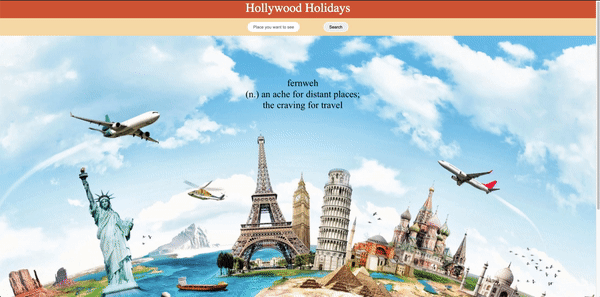
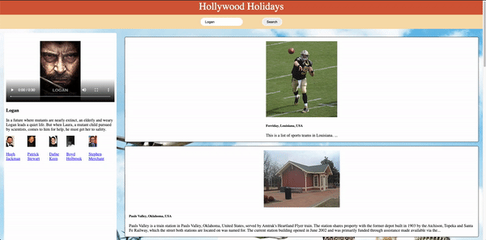
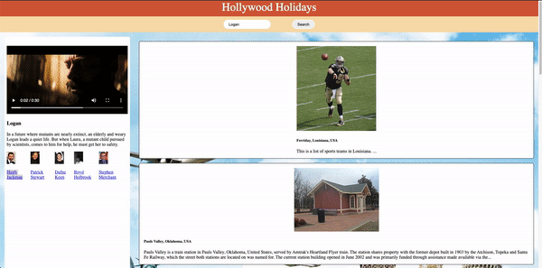

# Hollywood Holidays
This app is for all travel enthusiasts that are currently stuck at home during this COVID-19 
travel restrictions.

One of the goals of this app is to satisfy travel cravings, provide entertainment while at home and
to look for possible destinations, as seen in the movies, once travel bans are lifted across the globe.

Ever wondered where a movie was filmed? Type in the movie and we will help you find it! First, type
in the movie that you’ve been wanting to see or have already seen in the search bar and click search!
The app will present you with some quick information about the movie and also the trailer in case you
wanted to see a sneak peek of destinations in the film. You will also find the filming locations on 
the left! We will provide you with the location where it was filmed, a description of the place, and 
also images for you to get inspired! Click on the image to see more photos! Don’t like what you see?
Type in another movie you love and find another destination that sparks your interest!

Application was deployed with Javascript, JQuery, HTML5/CSS3, mayapifilms API, and Wiki API.

## Link to deploy application
[Hollywood Holidays](https://leonle.github.io/Hollywood-Holidays/)

## Usage

Enter a movie name to search for its information.

Users are able to view the trailers(if exists), actors, and places where the movie was filmed.

Details about filming location are pulled from Wikipedia API and snippets of the Article.
More information can be obtained when you click on the location card.

## Questions 

If you have any questions about the repo, open the issue or contact [LeoNLe](https://github.com/leoNle)
directly at lnle125@gmail.com

